<h1 align="center">
  <br>
  <a href="https://github.com/darmado/attack-macOS"></a>
  <br>
</h1>

<div align="center">

  
  
  
  [](_DOCS/Procedures/Procedure%20Matrix.md)
  
  
  
  [](https://x.com/attackmacos)
<br>
-grey?style=for-the-badge)

-grey?style=for-the-badge)

<br>
<br>
  <a href="#mitre-attck-coverage-matrix">ATT&CK Matrix</a> •
  <a href="#key-features">Key Features</a> •
  <a href="#quick-start">Quick Start</a> •
  <a href="wiki/R&D%20Library">Research Library</a>
<br>
<br>

Attack-macOS is a library of scripts that security teams can use to evaluate macOS endpoint detection and response capabilities. This project aims to simplify the execution of Living Off The Land (LOTL) techniques via standalone scripts with built-in encoding, encryption, formatting, logging, and exfiltration over DNS and HTTP/S.


##



##

## Key Features

| Feature | Description |
|:--------|:------------|
| **Builder Tool** | Includes a YAML template, schema, and builder tool for creating new scripts with built-in argument parsing and validation. [Parse Args](wiki/R&D%20Library/Functions/Shell/Parse%20Args.md) |
| **Modular Design** | Self-contained scripts that can be used independently or combined, easily integrating with existing security test frameworks. |
| **Customizable** | Easily modifiable and extendable, with centralized execution control via global variables and flags. [Input Validation](wiki/R&D%20Library/Functions/Shell/Input%20Validation.md) |
| **macOS Native** | Uses native tools and languages to emulate adversary techniques without external dependencies. See [LOOBins](https://www.loobins.io/) for comprehensive macOS binary documentation. |
| **MITRE ATT&CK Mapped** | All scripts and arguments directly mapped to the MITRE ATT&CK framework. |
| **Logging** | Built-in syslog logging capability with output formatting in JSON or CSV for analysis. [Log Output](wiki/R&D%20Library/Functions/Shell/Log%20Output.md) |
| **Encoding and Encryption** | Multiple data encoding options and integrated encryption functions including AES-256-CBC, GPG, and XOR. [Encode Output](wiki/R&D%20Library/Functions/Shell/Encode%20Output.md) • [Encrypt Output](wiki/R&D%20Library/Functions/Shell/Encrypt%20Output.md) |
| **Exfiltration** | Simulates data exfiltration via HTTP/S or DNS protocols. [Exfiltrate Data](wiki/R&D%20Library/Functions/Shell/Exfiltrate%20Data.md) |
| **CI/CD Pipeline Ready** | Integrates with existing security tools, automation pipelines, and CI/CD workflows. |

##


# Executon Workflow

```mermaid
flowchart TD
    A[Step 1: Choose your procedure] --> A1["🐚 Shell Scripts"]
    A --> A2["🟡 JXA Scripts"]
    A --> A3["🐍 Python Scripts"]
    A --> A4["🦉 Swift Scripts"]
    
    A1 --> B[Step 2: Choose Execution Type]
    A2 --> B
    A3 --> B
    A4 --> B
    
    B --> B1["🏠 Local Execution"]
    B --> B2["☁️ Remote Execution"]
    
    B1 --> C[Step 3: Execute with Built-in Capabilities]
    B2 --> C
    
    C --> C1["🔧 Native macOS Tools"]
    C --> C2["🔐 Encode & Encrypt"]
    C --> C3["📡 Exfiltrate Data"]
    C --> C4["📝 Log Results"]
    
    C1 --> D[Step 4: Analyze Results]
    C2 --> D
    C3 --> D
    C4 --> D
    
    D --> D1["✅ Test Detection Capabilities<br/>📊 Evaluate Security Controls<br/>🎯 Identify Coverage Gaps"]
    
    style A fill:#e84393,stroke:#d63031,stroke-width:2px,color:#fff
    style B fill:#6c5ce7,stroke:#5f3dc4,stroke-width:2px,color:#fff
    style B1 fill:#74b9ff,stroke:#0984e3,stroke-width:2px,color:#fff
    style C fill:#6c5ce7,stroke:#5f3dc4,stroke-width:2px,color:#fff
    style D fill:#00b894,stroke:#00a085,stroke-width:2px,color:#fff
    style D1 fill:#74b9ff,stroke:#0984e3,stroke-width:2px,color:#fff
```


##


[](_DOCS/Procedures/Procedure%20Matrix.md)
# MITRE ATT&CK Coverage Matrix 


  </div>

<div align="center">


</div>


<details align="center">


<div align="center">

</div>

##

| Initial Access | Execution | Persistence | Privilege Escalation | Defense Evasion | Credential Access | Discovery | Lateral Movement | Collection | Command And Control | Exfiltration | Impact |
| --- | --- | --- | --- | --- | --- | --- | --- | --- | --- | --- | --- |
| </br><sub>External Remote Services</sub> | </br><sub>Shared Modules</sub> | </br><sub>Socket Filters</sub> | </br><sub>Boot or Logon Initialization Scripts</sub> | </br><sub>Socket Filters</sub> | </br><sub>Adversary-in-the-Middle</sub> | </br><sub>System Owner/User Discovery</sub> | </br><sub>VNC</sub> | </br><sub>Archive via Utility</sub> | </br><sub>Socket Filters</sub> | </br><sub>Exfiltration Over Web Service</sub> | </br><sub>Disk Structure Wipe</sub> |
| </br><sub>Compromise Software Dependencies and Development Tools</sub> | </br><sub>JavaScript</sub> | </br><sub>Boot or Logon Initialization Scripts</sub> | </br><sub>Path Interception by PATH Environment Variable</sub> | </br><sub>Embedded Payloads</sub> | </br><sub>Pluggable Authentication Modules</sub> | </br><sub>Internet Connection Discovery</sub> | </br><sub>Taint Shared Content</sub> | </br><sub>Screen Capture</sub> | </br><sub>Standard Encoding</sub> | </br><sub>Exfiltration Over Webhook</sub> | </br><sub>Direct Network Flood</sub> |
| </br><sub>Spearphishing Link</sub> | </br><sub>Malicious File</sub> | </br><sub>Pluggable Authentication Modules</sub> | </br><sub>Create or Modify System Process</sub> | </br><sub>Pluggable Authentication Modules</sub> | </br><sub>Keylogging</sub> | </br><sub>Permission Groups Discovery</sub> | </br><sub>SSH</sub> | </br><sub>Adversary-in-the-Middle</sub> | </br><sub>Domain Generation Algorithms</sub> | </br><sub>Scheduled Transfer</sub> | </br><sub>External Defacement</sub> |
| </br><sub>Spearphishing Attachment</sub> | </br><sub>Cron</sub> | </br><sub>Path Interception by PATH Environment Variable</sub> | </br><sub>LC_LOAD_DYLIB Addition</sub> | </br><sub>File/Path Exclusions</sub> | </br><sub>Password Guessing</sub> | </br><sub>Device Driver Discovery</sub> | </br><sub>SSH Hijacking</sub> | </br><sub>Keylogging</sub> | </br><sub>DNS</sub> | </br><sub>Exfiltration Over Other Network Medium</sub> | </br><sub>OS Exhaustion Flood</sub> |
| </br><sub>Compromise Hardware Supply Chain</sub> | </br><sub>Scheduled Task/Job</sub> | </br><sub>Create or Modify System Process</sub> | </br><sub>Sudo and Sudo Caching</sub> | </br><sub>Linux and Mac File and Directory Permissions Modification</sub> | </br><sub>OS Credential Dumping</sub> | </br><sub>Domain Account</sub> | </br><sub>Remote Services</sub> | </br><sub>Audio Capture</sub> | </br><sub>Symmetric Cryptography</sub> | </br><sub>Exfiltration Over Bluetooth</sub> | </br><sub>Application Exhaustion Flood</sub> |
| </br><sub>Supply Chain Compromise</sub> | </br><sub>AppleScript</sub> | </br><sub>External Remote Services</sub> | </br><sub>Boot or Logon Autostart Execution</sub> | </br><sub>Path Interception by PATH Environment Variable</sub> | </br><sub>Steal Web Session Cookie</sub> | ](https://img.shields.io/badge/T1087.001-lightgrey?style=for-the-badge&label=%2012%20&labelColor=3bc05a&color=494949)</br><sub>Local Account</sub> | </br><sub>Remote Service Session Hijacking</sub> | </br><sub>Archive via Custom Method</sub> | </br><sub>Fast Flux DNS</sub> | </br><sub>Automated Exfiltration</sub> | </br><sub>Disk Wipe</sub> |
| </br><sub>Exploit Public-Facing Application</sub> | </br><sub>Native API</sub> | </br><sub>LC_LOAD_DYLIB Addition</sub> | </br><sub>Cron</sub> | </br><sub>Email Hiding Rules</sub> | </br><sub>Securityd Memory</sub> | </br><sub>System Checks</sub> | </br><sub>Software Deployment Tools</sub> | </br><sub>Email Collection</sub> | </br><sub>Application Layer Protocol</sub> | </br><sub>Exfiltration Over Symmetric Encrypted Non-C2 Protocol</sub> | </br><sub>Stored Data Manipulation</sub> |
| </br><sub>Content Injection</sub> | </br><sub>Command and Scripting Interpreter</sub> | </br><sub>Boot or Logon Autostart Execution</sub> | </br><sub>Scheduled Task/Job</sub> | </br><sub>Encrypted/Encoded File</sub> | </br><sub>Password Cracking</sub> | </br><sub>Domain Groups</sub> | </br><sub>Exploitation of Remote Services</sub> | </br><sub>Data from Removable Media</sub> | </br><sub>Remote Access Software</sub> | </br><sub>Exfiltration to Code Repository</sub> | </br><sub>Service Stop</sub> |
| </br><sub>Default Accounts</sub> | </br><sub>Launchctl</sub> | </br><sub>Cron</sub> | </br><sub>Login Hook</sub> | </br><sub>Rootkit</sub> | ](https://img.shields.io/badge/T1555.001-lightgrey?style=for-the-badge&label=%209%20&labelColor=3bc05a&color=494949)</br><sub>Keychain</sub> | </br><sub>System Service Discovery</sub> | </br><sub>Internal Spearphishing</sub> | </br><sub>Local Data Staging</sub> | </br><sub>Content Injection</sub> | </br><sub>Exfiltration Over Asymmetric Encrypted Non-C2 Protocol</sub> | </br><sub>Application or System Exploitation</sub> |
| </br><sub>Trusted Relationship</sub> | </br><sub>XPC Services</sub> | </br><sub>Scheduled Task/Job</sub> | </br><sub>Process Injection</sub> | </br><sub>Sudo and Sudo Caching</sub> | </br><sub>Password Managers</sub> | </br><sub>Network Sniffing</sub> | </br><sub>Lateral Tool Transfer</sub> | </br><sub>Automated Collection</sub> | </br><sub>Traffic Signaling</sub> | ](https://img.shields.io/badge/T1041-lightgrey?style=for-the-badge&label=%202%20&labelColor=3bc05a&color=494949)</br><sub>Exfiltration Over C2 Channel</sub> | </br><sub>Runtime Data Manipulation</sub> |
| </br><sub>Phishing</sub> | </br><sub>User Execution</sub> | </br><sub>Browser Extensions</sub> | </br><sub>Launch Daemon</sub> | </br><sub>Match Legitimate Name or Location</sub> | </br><sub>Network Sniffing</sub> | </br><sub>Network Share Discovery</sub> |  | </br><sub>Clipboard Data</sub> | </br><sub>Protocol Tunneling</sub> | </br><sub>Exfiltration Over Alternative Protocol</sub> | </br><sub>Reflection Amplification</sub> |
| ](https://img.shields.io/badge/T1078-lightgrey?style=for-the-badge&label=%202%20&labelColor=3bc05a&color=494949)</br><sub>Valid Accounts</sub> | </br><sub>Software Deployment Tools</sub> | </br><sub>Login Hook</sub> | </br><sub>Default Accounts</sub> | </br><sub>Masquerade File Type</sub> | </br><sub>Steal or Forge Kerberos Tickets</sub> | </br><sub>Peripheral Device Discovery</sub> |  | </br><sub>Remote Data Staging</sub> | </br><sub>Mail Protocols</sub> | </br><sub>Exfiltration over USB</sub> | </br><sub>Service Exhaustion Flood</sub> |
| </br><sub>Spearphishing Voice</sub> | </br><sub>Unix Shell</sub> | </br><sub>Traffic Signaling</sub> | </br><sub>Trap</sub> | </br><sub>Hide Artifacts</sub> | </br><sub>Credentials from Password Stores</sub> | </br><sub>System Information Discovery</sub> |  | </br><sub>Data from Local System</sub> | </br><sub>Communication Through Removable Media</sub> | </br><sub>Exfiltration to Text Storage Sites</sub> | </br><sub>Defacement</sub> |
| </br><sub>Compromise Software Supply Chain</sub> | </br><sub>Inter-Process Communication</sub> | </br><sub>Launch Daemon</sub> | </br><sub>Dynamic Linker Hijacking</sub> | </br><sub>System Checks</sub> | </br><sub>Unsecured Credentials</sub> | </br><sub>Wi-Fi Discovery</sub> |  | </br><sub>Archive via Library</sub> | </br><sub>External Proxy</sub> | </br><sub>Exfiltration to Cloud Storage</sub> | </br><sub>Financial Theft</sub> |
| </br><sub>Domain Accounts</sub> | </br><sub>Exploitation for Client Execution</sub> | </br><sub>Web Shell</sub> | </br><sub>Abuse Elevation Control Mechanism</sub> | </br><sub>Clear Linux or Mac System Logs</sub> | </br><sub>Credentials from Web Browsers</sub> | </br><sub>Application Window Discovery</sub> |  | </br><sub>Archive Collected Data</sub> | </br><sub>Proxy</sub> | </br><sub>Data Transfer Size Limits</sub> | </br><sub>Internal Defacement</sub> |
| </br><sub>Hardware Additions</sub> | ](https://img.shields.io/badge/T1059.006-lightgrey?style=for-the-badge&label=%201%20&labelColor=3bc05a&color=494949)</br><sub>Python</sub> | </br><sub>Default Accounts</sub> | </br><sub>Setuid and Setgid</sub> | </br><sub>Stripped Payloads</sub> | </br><sub>DHCP Spoofing</sub> | </br><sub>Time Based Evasion</sub> |  | </br><sub>DHCP Spoofing</sub> | </br><sub>Dynamic Resolution</sub> | </br><sub>Exfiltration Over Physical Medium</sub> | </br><sub>Data Manipulation</sub> |
| </br><sub>Drive-by Compromise</sub> | </br><sub>System Services</sub> | </br><sub>Trap</sub> | </br><sub>SSH Authorized Keys</sub> | </br><sub>Gatekeeper Bypass</sub> | </br><sub>Private Keys</sub> | ](https://img.shields.io/badge/T1217-lightgrey?style=for-the-badge&label=%204%20&labelColor=3bc05a&color=494949)</br><sub>Browser Information Discovery</sub> |  | </br><sub>Web Portal Capture</sub> | </br><sub>Web Service</sub> | </br><sub>Exfiltration Over Unencrypted Non-C2 Protocol</sub> | </br><sub>Account Access Removal</sub> |
| </br><sub>Spearphishing via Service</sub> | </br><sub>Visual Basic</sub> | </br><sub>Dynamic Linker Hijacking</sub> | </br><sub>Login Items</sub> | </br><sub>Code Signing</sub> | </br><sub>Password Spraying</sub> | </br><sub>System Network Configuration Discovery</sub> |  | </br><sub>Video Capture</sub> | </br><sub>DNS Calculation</sub> |  | </br><sub>Data Encrypted for Impact</sub> |
| </br><sub>Local Accounts</sub> | </br><sub>Malicious Link</sub> | </br><sub>Local Account</sub> | </br><sub>Emond</sub> | </br><sub>Break Process Trees</sub> | </br><sub>Web Portal Capture</sub> | </br><sub>Account Discovery</sub> |  | </br><sub>Email Forwarding Rule</sub> | </br><sub>Multi-Stage Channels</sub> |  | </br><sub>Endpoint Denial of Service</sub> |
|  | </br><sub>At</sub> | </br><sub>SSH Authorized Keys</sub> | </br><sub>Account Manipulation</sub> | </br><sub>Clear Network Connection History and Configurations</sub> | </br><sub>Steal or Forge Authentication Certificates</sub> | </br><sub>File and Directory Discovery</sub> |  | </br><sub>Data Staged</sub> | </br><sub>Port Knocking</sub> |  | </br><sub>Resource Hijacking</sub> |
|  |  | </br><sub>Domain Account</sub> | </br><sub>Kernel Modules and Extensions</sub> | </br><sub>Clear Command History</sub> | </br><sub>Bash History</sub> | </br><sub>System Network Connections Discovery</sub> |  | </br><sub>GUI Input Capture</sub> | </br><sub>File Transfer Protocols</sub> |  | </br><sub>Transmitted Data Manipulation</sub> |
|  |  | </br><sub>Component Firmware</sub> | </br><sub>Hijack Execution Flow</sub> | ](https://img.shields.io/badge/T1140-lightgrey?style=for-the-badge&label=%201%20&labelColor=3bc05a&color=494949)</br><sub>Deobfuscate/Decode Files or Information</sub> | </br><sub>Credentials In Files</sub> | </br><sub>Virtualization/Sandbox Evasion</sub> |  | </br><sub>Data from Network Shared Drive</sub> | </br><sub>One-Way Communication</sub> |  | </br><sub>Data Destruction</sub> |
|  |  | </br><sub>Pre-OS Boot</sub> | ](https://img.shields.io/badge/T1078-lightgrey?style=for-the-badge&label=%202%20&labelColor=3bc05a&color=494949)</br><sub>Valid Accounts</sub> | </br><sub>Impair Defenses</sub> | </br><sub>Web Cookies</sub> | </br><sub>Log Enumeration</sub> |  | </br><sub>Input Capture</sub> | </br><sub>Multi-hop Proxy</sub> |  | </br><sub>Network Denial of Service</sub> |
|  |  | </br><sub>Login Items</sub> | </br><sub>Exploitation for Privilege Escalation</sub> | </br><sub>Masquerading</sub> | </br><sub>Forge Web Credentials</sub> | </br><sub>Process Discovery</sub> |  | </br><sub>ARP Cache Poisoning</sub> | </br><sub>Data Obfuscation</sub> |  | </br><sub>Firmware Corruption</sub> |
|  |  | </br><sub>Port Knocking</sub> | </br><sub>Event Triggered Execution</sub> | </br><sub>Clear Mailbox Data</sub> | </br><sub>Multi-Factor Authentication Request Generation</sub> | </br><sub>User Activity Based Checks</sub> |  | </br><sub>Data from Information Repositories</sub> | </br><sub>Non-Standard Port</sub> |  | </br><sub>Inhibit System Recovery</sub> |
|  |  | </br><sub>Compromise Host Software Binary</sub> | </br><sub>Unix Shell Configuration Modification</sub> | </br><sub>Process Injection</sub> | </br><sub>Exploitation for Credential Access</sub> | </br><sub>Local Groups</sub> |  |  | </br><sub>Encrypted Channel</sub> |  | </br><sub>Disk Content Wipe</sub> |
|  |  | </br><sub>Emond</sub> | </br><sub>Elevated Execution with Prompt</sub> | </br><sub>Traffic Signaling</sub> | </br><sub>GUI Input Capture</sub> | </br><sub>Password Policy Discovery</sub> |  |  | </br><sub>Bidirectional Communication</sub> |  | </br><sub>System Shutdown/Reboot</sub> |
|  |  | </br><sub>Account Manipulation</sub> | </br><sub>Startup Items</sub> | </br><sub>System Binary Proxy Execution</sub> | </br><sub>Brute Force</sub> | </br><sub>System Language Discovery</sub> |  |  | </br><sub>Asymmetric Cryptography</sub> |  |  |
|  |  | </br><sub>Kernel Modules and Extensions</sub> | </br><sub>Domain Accounts</sub> | </br><sub>Timestomp</sub> | </br><sub>Credential Stuffing</sub> | </br><sub>System Location Discovery</sub> |  |  | </br><sub>Non-Application Layer Protocol</sub> |  |  |
|  |  | </br><sub>Hijack Execution Flow</sub> | </br><sub>Launch Agent</sub> | </br><sub>Reflective Code Loading</sub> | </br><sub>Multi-Factor Authentication</sub> | ](https://img.shields.io/badge/T1518.001-lightgrey?style=for-the-badge&label=%2010%20&labelColor=3bc05a&color=494949)</br><sub>Security Software Discovery</sub> |  |  | </br><sub>Protocol Impersonation</sub> |  |  |
|  |  | ](https://img.shields.io/badge/T1078-lightgrey?style=for-the-badge&label=%202%20&labelColor=3bc05a&color=494949)</br><sub>Valid Accounts</sub> | </br><sub>Installer Packages</sub> | </br><sub>Ignore Process Interrupts</sub> | </br><sub>Input Capture</sub> | </br><sub>Remote System Discovery</sub> |  |  | </br><sub>Domain Fronting</sub> |  |  |
|  |  | </br><sub>Multi-Factor Authentication</sub> | </br><sub>RC Scripts</sub> | </br><sub>Time Based Evasion</sub> | </br><sub>ARP Cache Poisoning</sub> | </br><sub>Network Service Discovery</sub> |  |  | </br><sub>Data Encoding</sub> |  |  |
|  |  | </br><sub>Event Triggered Execution</sub> | </br><sub>Re-opened Applications</sub> | </br><sub>Disable or Modify System Firewall</sub> | </br><sub>Multi-Factor Authentication Interception</sub> | </br><sub>Software Discovery</sub> |  |  | </br><sub>Non-Standard Encoding</sub> |  |  |
|  |  | </br><sub>Unix Shell Configuration Modification</sub> | </br><sub>TCC Manipulation</sub> | </br><sub>Electron Applications</sub> | </br><sub>Modify Authentication Process</sub> | </br><sub>Debugger Evasion</sub> |  |  | </br><sub>Web Protocols</sub> |  |  |
|  |  | </br><sub>Startup Items</sub> | </br><sub>At</sub> | </br><sub>Code Signing Policy Modification</sub> |  | </br><sub>System Time Discovery</sub> |  |  | </br><sub>Ingress Tool Transfer</sub> |  |  |
|  |  | </br><sub>Domain Accounts</sub> | </br><sub>Dylib Hijacking</sub> | ](https://img.shields.io/badge/T1027.001-lightgrey?style=for-the-badge&label=%201%20&labelColor=3bc05a&color=494949)</br><sub>Binary Padding</sub> |  |  |  |  | </br><sub>Hide Infrastructure</sub> |  |  |
|  |  | </br><sub>Launch Agent</sub> | </br><sub>Local Accounts</sub> | </br><sub>Default Accounts</sub> |  |  |  |  | </br><sub>Steganography</sub> |  |  |
|  |  | </br><sub>Server Software Component</sub> |  | </br><sub>Dynamic Linker Hijacking</sub> |  |  |  |  | </br><sub>Fallback Channels</sub> |  |  |
|  |  | </br><sub>Installer Packages</sub> |  | </br><sub>File and Directory Permissions Modification</sub> |  |  |  |  | </br><sub>Internal Proxy</sub> |  |  |
|  |  | </br><sub>RC Scripts</sub> |  | </br><sub>Abuse Elevation Control Mechanism</sub> |  |  |  |  | </br><sub>Dead Drop Resolver</sub> |  |  |
|  |  | </br><sub>Create Account</sub> |  | </br><sub>Setuid and Setgid</sub> |  |  |  |  | </br><sub>Junk Data</sub> |  |  |
|  |  | </br><sub>Re-opened Applications</sub> |  | </br><sub>Indicator Blocking</sub> |  |  |  |  |  |  |  |
|  |  | </br><sub>Power Settings</sub> |  | </br><sub>Right-to-Left Override</sub> |  |  |  |  |  |  |  |
|  |  | </br><sub>At</sub> |  | </br><sub>Component Firmware</sub> |  |  |  |  |  |  |  |
|  |  | </br><sub>Modify Authentication Process</sub> |  | </br><sub>Indicator Removal</sub> |  |  |  |  |  |  |  |
|  |  | </br><sub>Dylib Hijacking</sub> |  | </br><sub>Masquerade Task or Service</sub> |  |  |  |  |  |  |  |
|  |  | </br><sub>Local Accounts</sub> |  | </br><sub>Plist File Modification</sub> |  |  |  |  |  |  |  |
|  |  |  |  | </br><sub>Pre-OS Boot</sub> |  |  |  |  |  |  |  |
|  |  |  |  | </br><sub>Downgrade Attack</sub> |  |  |  |  |  |  |  |
|  |  |  |  | </br><sub>Virtualization/Sandbox Evasion</sub> |  |  |  |  |  |  |  |
|  |  |  |  | </br><sub>Execution Guardrails</sub> |  |  |  |  |  |  |  |
|  |  |  |  | </br><sub>Port Knocking</sub> |  |  |  |  |  |  |  |
|  |  |  |  | </br><sub>Hidden Users</sub> |  |  |  |  |  |  |  |
|  |  |  |  | </br><sub>Impair Command History Logging</sub> |  |  |  |  |  |  |  |
|  |  |  |  | </br><sub>User Activity Based Checks</sub> |  |  |  |  |  |  |  |
|  |  |  |  | </br><sub>Disable or Modify Tools</sub> |  |  |  |  |  |  |  |
|  |  |  |  | </br><sub>Hijack Execution Flow</sub> |  |  |  |  |  |  |  |
|  |  |  |  | </br><sub>Indicator Removal from Tools</sub> |  |  |  |  |  |  |  |
|  |  |  |  | ](https://img.shields.io/badge/T1078-lightgrey?style=for-the-badge&label=%202%20&labelColor=3bc05a&color=494949)</br><sub>Valid Accounts</sub> |  |  |  |  |  |  |  |
|  |  |  |  | </br><sub>Resource Forking</sub> |  |  |  |  |  |  |  |
|  |  |  |  | ](https://img.shields.io/badge/T1027-lightgrey?style=for-the-badge&label=%202%20&labelColor=3bc05a&color=494949)</br><sub>Obfuscated Files or Information</sub> |  |  |  |  |  |  |  |
|  |  |  |  | </br><sub>Multi-Factor Authentication</sub> |  |  |  |  |  |  |  |
|  |  |  |  | </br><sub>Invalid Code Signature</sub> |  |  |  |  |  |  |  |
|  |  |  |  | </br><sub>Run Virtual Instance</sub> |  |  |  |  |  |  |  |
|  |  |  |  | </br><sub>Subvert Trust Controls</sub> |  |  |  |  |  |  |  |
|  |  |  |  | </br><sub>Elevated Execution with Prompt</sub> |  |  |  |  |  |  |  |
|  |  |  |  | </br><sub>Rename System Utilities</sub> |  |  |  |  |  |  |  |
|  |  |  |  | </br><sub>Spoof Security Alerting</sub> |  |  |  |  |  |  |  |
|  |  |  |  | ](https://img.shields.io/badge/T1027.003-lightgrey?style=for-the-badge&label=%201%20&labelColor=3bc05a&color=494949)</br><sub>Steganography</sub> |  |  |  |  |  |  |  |
|  |  |  |  | </br><sub>Domain Accounts</sub> |  |  |  |  |  |  |  |
|  |  |  |  | </br><sub>Install Root Certificate</sub> |  |  |  |  |  |  |  |
|  |  |  |  | </br><sub>Compile After Delivery</sub> |  |  |  |  |  |  |  |
|  |  |  |  | </br><sub>VBA Stomping</sub> |  |  |  |  |  |  |  |
|  |  |  |  | </br><sub>Impersonation</sub> |  |  |  |  |  |  |  |
|  |  |  |  | </br><sub>Hidden Window</sub> |  |  |  |  |  |  |  |
|  |  |  |  | </br><sub>Clear Persistence</sub> |  |  |  |  |  |  |  |
|  |  |  |  | </br><sub>HTML Smuggling</sub> |  |  |  |  |  |  |  |
|  |  |  |  | </br><sub>Command Obfuscation</sub> |  |  |  |  |  |  |  |
|  |  |  |  | </br><sub>File Deletion</sub> |  |  |  |  |  |  |  |
|  |  |  |  | </br><sub>Software Packing</sub> |  |  |  |  |  |  |  |
|  |  |  |  | </br><sub>Hidden File System</sub> |  |  |  |  |  |  |  |
|  |  |  |  | </br><sub>Debugger Evasion</sub> |  |  |  |  |  |  |  |
|  |  |  |  | </br><sub>Space after Filename</sub> |  |  |  |  |  |  |  |
|  |  |  |  | </br><sub>TCC Manipulation</sub> |  |  |  |  |  |  |  |
|  |  |  |  | </br><sub>Hidden Files and Directories</sub> |  |  |  |  |  |  |  |
|  |  |  |  | </br><sub>Environmental Keying</sub> |  |  |  |  |  |  |  |
|  |  |  |  | </br><sub>Modify Authentication Process</sub> |  |  |  |  |  |  |  |
|  |  |  |  | </br><sub>Dylib Hijacking</sub> |  |  |  |  |  |  |  |
|  |  |  |  | </br><sub>Local Accounts</sub> |  |  |  |  |  |  |  |
|  |  |  |  | </br><sub>Exploitation for Defense Evasion</sub> |  |  |  |  |  |  |  |

</details>


##

# Quick Start

**Download attackmacos.sh:**

```
curl -O https://raw.githubusercontent.com/darmado/attack-macOS/main/attackmacos/attackmacos.sh
```

**Execute techniques locally:**

```
# Execute a discovery technique
./attackmacos.sh --method local --tactic discovery --ttp browser_history --args='--safari'

# List available techniques for a tactic  
./attackmacos.sh --list --tactic discovery

# Show help and available options
./attackmacos.sh --help
```

**Direct remote execution (no local files needed):**

```
# Execute a technique directly from GitHub
curl -sSL https://raw.githubusercontent.com/darmado/attack-macOS/main/attackmacos/ttp/discovery/browser_history/browser_history.sh | sh -s -- --safari

# Execute with help to see available options
curl -sSL https://raw.githubusercontent.com/darmado/attack-macOS/main/attackmacos/ttp/discovery/browser_history/browser_history.sh | sh -s -- --help
```

**For development/customization (full repository):**

```
git clone https://github.com/darmado/attack-macOS.git
cd attack-macOS/attackmacos
./attackmacos.sh --list
```

##


### License

This project is licensed under the Apache License 2.0. See the [LICENSE](LICENSE) file for more details.

##


### Credits and References
In short, every macOS-focused open-source security project, blog post, CTI, Apple Dev Docs, especially the archived docs, and MITRE ATT&CK.
 
- [References](wiki/References.md)
- [Acknowledgements](wiki/Acknowledgements.md) 

## Docs

- [Wiki Home](wiki/) 
- [Tool Index](wiki/R&D%20Library/Index/Tool%20Index.md) 
- [Procedure Index](wiki/R&D%20Library/Index/Procedure%20Index.md)
- [Function Index](wiki/R&D%20Library/Index/Function%20Index.md) 
- [Global Variables](wiki/R&D%20Library/Index/Global%20Variables.md) 
- [Roadmap](wiki/ROADMAP.md) 
- [How To Guides](wiki/How%20To/) 


