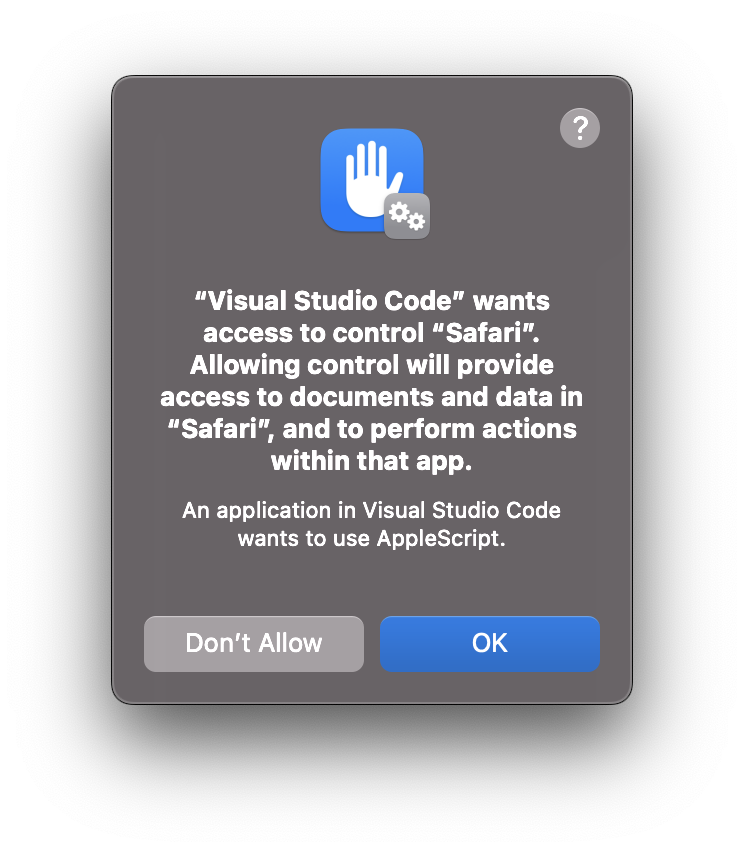

# TCC OPSEC with JXA

## Overview

This document details practical procedures to enumerate Transparency, Consent, and Control (TCC) permissions with JavaScript for Automation (JXA) maintaining ood OPSEC priciples.



## Key Principles

1. Minimal Footprint: Perform checks with the least possible system interaction.
2. Logical Progression: Start with the least privileged checks and escalate gradually.
3. Anomaly Detection: Be alert to unexpected behaviors that might indicate honeypots or canaries.
4. Plausible Deniability: Ensure checks can be explained as part of normal system operations.

## Methodical Approach with JXA Examples

### 1. Initial Reconnaissance

Check for the existence of TCC-related directories without accessing their contents:

```javascript
ObjC.import('Foundation');

function checkTCCDirectoryExistence() {
    const fileManager = $.NSFileManager.defaultManager;
    const homeDir = $.NSHomeDirectory().js;
    const tccPath = `${homeDir}/Library/Application Support/com.apple.TCC`;
    
    return fileManager.fileExistsAtPath(tccPath);
}

console.log("TCC directory exists:", checkTCCDirectoryExistence());
```

### 2. Metadata Analysis

Utilize MDQuery to search for TCC.db files without directly accessing them:

```javascript
ObjC.import('CoreServices');

function searchForTCCDb() {
    const query = $.MDQueryCreate(null, "kMDItemDisplayName == 'TCC.db'", null, null);
    $.MDQueryExecute(query, 0);
    
    const results = [];
    for (let i = 0; i < $.MDQueryGetResultCount(query); i++) {
        const result = $.MDQueryGetResultAtIndex(query, i);
        const path = ObjC.unwrap($.MDItemCopyAttribute(result, 'kMDItemPath'));
        results.push(path);
    }
    
    return results;
}

console.log("TCC.db files found:", searchForTCCDb());
```

### 3. Permission Escalation Checks

Attempt to access increasingly sensitive areas, starting with user directories:

```javascript
function checkDirectoryAccess(directories) {
    const fileManager = $.NSFileManager.defaultManager;
    const results = {};
    
    directories.forEach(dir => {
        results[dir] = fileManager.isReadableFileAtPath(dir);
    });
    
    return results;
}

const dirsToCheck = [
    $.NSHomeDirectory().js,
    '/Library/Application Support',
    '/Library/Application Support/com.apple.TCC'
];

console.log("Directory access results:", checkDirectoryAccess(dirsToCheck));
```

### 4. FDA Verification

Use the MDQuery result count as an indicator of FDA:

```javascript
function checkFullDiskAccess() {
    const query = $.MDQueryCreate(null, "kMDItemDisplayName == 'TCC.db'", null, null);
    $.MDQueryExecute(query, 0);
    
    const resultCount = $.MDQueryGetResultCount(query);
    return resultCount === 2; // 2 results typically indicate FDA
}

console.log("Has Full Disk Access:", checkFullDiskAccess());
```

## Detecting Honeypots and Canaries

### 1. Inconsistent Permissions

Check for unexpected access patterns:

```javascript
function detectInconsistentPermissions() {
    const fileManager = $.NSFileManager.defaultManager;
    const sensitiveDir = '/Library/Application Support/com.apple.TCC';
    const userDir = $.NSHomeDirectory().js;
    
    const canAccessSensitive = fileManager.isReadableFileAtPath(sensitiveDir);
    const canAccessUser = fileManager.isReadableFileAtPath(userDir);
    
    if (canAccessSensitive && !canAccessUser) {
        console.log("Warning: Inconsistent permissions detected. Possible honeypot.");
        return true;
    }
    return false;
}

console.log("Inconsistent permissions detected:", detectInconsistentPermissions());
```

### 2. Unusual File Characteristics

Look for TCC.db files with atypical sizes or dates:

```javascript
function checkTCCDbCharacteristics() {
    const fileManager = $.NSFileManager.defaultManager;
    const tccDbPath = `${$.NSHomeDirectory().js}/Library/Application Support/com.apple.TCC/TCC.db`;
    
    const attrs = fileManager.attributesOfItemAtPathError(tccDbPath, $());
    if (attrs) {
        const size = attrs.fileSize();
        const modDate = attrs.modificationDate();
        
        // Check for suspicious characteristics
        if (size < 1000 || size > 10000000) { // Arbitrary size thresholds
            console.log("Warning: Unusual TCC.db size detected.");
        }
        
        const now = $.NSDate.date;
        if (modDate.timeIntervalSinceDate(now) > 0) {
            console.log("Warning: TCC.db modification date is in the future.");
        }
    }
}

checkTCCDbCharacteristics();
```

## Best Practices

1. **Gradual Escalation**: Implement checks from least to most privileged:

```javascript
function gradualPermissionCheck() {
    if (checkTCCDirectoryExistence()) {
        if (searchForTCCDb().length > 0) {
            if (checkFullDiskAccess()) {
                console.log("Full Disk Access confirmed.");
            }
        }
    }
}

gradualPermissionCheck();
```

2. **Error Handling**: Implement robust error handling:

```javascript
function safeExecute(func) {
    try {
        return func();
    } catch (error) {
        console.log("Error occurred:", error.message);
        return null;
    }
}

safeExecute(checkFullDiskAccess);
```

3. **Logging Control**: Minimize or obfuscate your own logging:

```javascript
const DEBUG = false;

function debugLog(message) {
    if (DEBUG) {
        console.log("DEBUG:", message);
    }
}

debugLog("Performing TCC checks...");
```

4. **Plausible Cover**: Ensure your permission checks can be explained as part of legitimate software behavior:

```javascript
function checkSystemPreferences() {
    // Legitimate-looking function that includes TCC checks
    const prefPanes = listSystemPreferencePanes();
    checkFullDiskAccess(); // Hidden within normal operations
    return prefPanes;
}

function listSystemPreferencePanes() {
    // Actual implementation...
}
```

5. **Time-based Checks**: Implement time delays between checks:

```javascript
function delayedCheck(checkFunction, delay) {
    return new Promise((resolve) => {
        setTimeout(() => {
            resolve(checkFunction());
        }, delay);
    });
}

async function performChecks() {
    await delayedCheck(checkTCCDirectoryExistence, 1000);
    await delayedCheck(checkFullDiskAccess, 2000);
}

performChecks();
```

## Conclusion

When checking for TCC permissions in JXA, balance thoroughness with stealth. Use native APIs, implement gradual checks, and always consider the possibility of honeypots or canaries. Remember, the absence of evidence is not evidence of absence – the system might be intentionally masking its true permission state.
