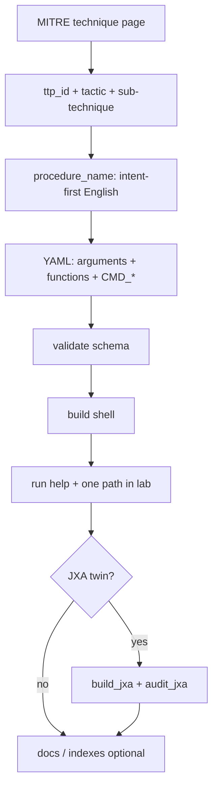
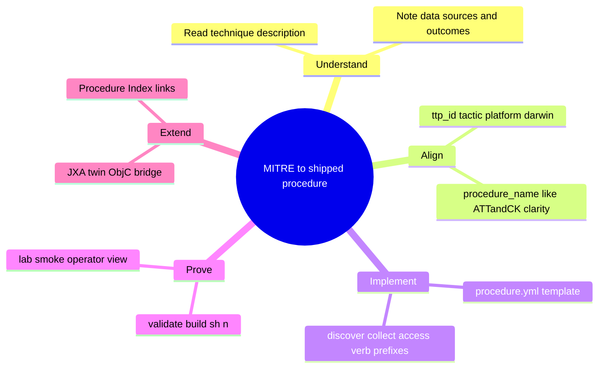

# Add a Procedure from MITRE ATT&CK

Day-to-day workflow: start from the **technique** (what adversaries achieve), name and scope the **procedure** in the same spirit as ATT&CK wording, then implement in YAML and ship through the builders. This reduces rework: clear intent first, modular YAML second, generated scripts last.

**Use with:** [Create a New TTP Fast.md](Create%20a%20New%20TTP%20Fast.md) (short commands), [Add a New Procedure in YAML.md](Add%20a%20New%20Procedure%20in%20YAML.md) (full field reference), [Naming Conventions.md](../Naming%20Conventions.md) (procedure names, flags, functions).

**Why this matters:** Red teams think in **objectives and chains**; ATT&CK names techniques by **outcome**. If `procedure_name` and flags read like internal jargon instead of that model, operators and reviewers spend cycles auditing intent instead of behavior. First principles here: **one technique identity → one clear procedure document → small composable functions → one generated artifact per executor** (shell today; JXA when you add it).

---

## Logic map (high level)



**Mind map (same story, radial):**



---

## Verify against MITRE (before you freeze `ttp_id` and metadata)

Bulk imports and Google snippets are not enough. **Read the technique** on ATT&CK, then align YAML `intent`, `detection`, and procedure examples.

1. **Official page** — Open `https://attack.mitre.org/techniques/<ID>/` (live and [version permalink](https://attack.mitre.org/versions/v19/techniques/T1217/) when you need a stable definition). Confirm the **technique name**, **tactic**, **platforms**, and whether **sub-techniques exist** (do not invent `T1217.001`-style IDs if the matrix lists “No sub-techniques”).
2. **Procedure Examples** — On the same page, the **Procedure Examples** table grounds realistic metadata and citations; use it when writing `intent` / `resources` / detection ideas.
3. **STIX (optional, authoritative machine-readable)** — MITRE publishes [mitre/cti](https://github.com/mitre/cti) (`enterprise-attack`, including [`attack-pattern`](https://github.com/mitre/cti/tree/master/enterprise-attack/attack-pattern) objects). This repo does **not** vendor the full bundle (size); clone or fetch objects locally when you need to diff wording or relationships (e.g. share discovery is **T1135**, not T1217).

**Example:** [T1217 — Browser Information Discovery](https://attack.mitre.org/techniques/T1217/) covers bookmarks, history, cookies, and similar browser-held data. A script that only touches bookmarks is still **T1217**; name the **procedure** for the slice (`browser_bookmarks` vs `browser_history`), not a fake sub-ID.

---

## Steps (conceptual)

1. **Pick the technique** — Use the official ATT&CK page for the technique or sub-technique. Record `ttp_id` and **tactic** (schema uses MITRE display names, e.g. `Discovery`). See [R&D References.md](../../R&D%20References.md) and coverage hints in [macOS Procedure Matrix.md](../../MITRE%20ATT&CK/macOS%20Procedure%20Matrix.md).
2. **Name the procedure** — `procedure_name` should read like **what the emulation does for the analyst**, not an opaque binary string (`software_version` not `sw_vers`). Short CLI flags carry **mode**, not repeated intent ([Naming Conventions.md](../Naming%20Conventions.md) — CLI options + `procedure_name` bullets).
3. **Author YAML** — Start from `attackmacos/core/templates/procedure.yml`. Fill `intent`, `detection`, `resources` honestly. Define `arguments` → `execute_function` → `functions` with `language: [shell]` and tactic-appropriate function prefixes (`discover_*`, `collect_*`, … per Naming Conventions). Use **`CMD_*`** / procedure `global_variable` for binaries ([Add a New Procedure in YAML.md](Add%20a%20New%20Procedure%20in%20YAML.md)).
4. **Validate** — `python3 cicd/build/build_shell_procedure.py --validate attackmacos/core/config/<name>.yml` against `attackmacos/core/schemas/procedure.schema.json`.
5. **Build** — `python3 cicd/build/build_shell_procedure.py attackmacos/core/config/<name>.yml` (includes `sh -n`). Output: `attackmacos/ttp/<tactic_slug>/shell/<procedure_name>.sh`. Details: [Create a New TTP Fast.md](Create%20a%20New%20TTP%20Fast.md), [docs/CICD/build_shell_procedure.md](../../CICD/build_shell_procedure.md).
6. **Verify** — `--help` plus at least one real execution path in a lab. Optional: `./attackmacos/attackmacos.sh --lint-local …` to re-check syntax without rebuilding ([Create a New TTP Fast.md](Create%20a%20New%20TTP%20Fast.md)).
7. **Optional JXA twin** — Same YAML can gain JXA functions with `language: [jxa]` when builders and schema support your layout; run **`python3 cicd/build/build_jxa_procedure.py`** and **`python3 cicd/audit/audit_jxa.py`**. See [JXA Script Blueprint.md](../../Functions/Shell/JXA%20Script%20Blueprint.md), [build_jxa_procedure.md](../../CICD/build_jxa_procedure.md), [Guides README](../README.md) (JXA bullet).
8. **Catalogs (LOOBins, ART, etc.)** — Treat as **reference only**. If you import or transcribe YAML, **re-map MITRE IDs, rename for intent, and verify** before the file is project canon. Do not bulk-port unverified upstream option text.

---

## Modular design (how pieces fit)

| Layer | Responsibility |
|-------|------------------|
| MITRE page | Truth for technique scope and wording |
| Procedure YAML | Operator contract: flags, intent, detection, function bodies |
| `base.sh` / `base.js` | Shared runtime (logging, encode/exfil, `CMD_*`) — change rarely; see [Add a New Base Feature.md](Add%20a%20New%20Base%20Feature.md) |
| Builders (`cicd/build/`) | Compile YAML → executable script; see [cicd/README.md](../../../cicd/README.md) |
| Indexes | Human navigation; update [Procedure Index.md](../../Indexes/Procedure%20Index.md) when you add user-facing commands worth listing |

---

## Operator FAQ: `system_time` vs `system_info` (and similar pairs)

They are **different MITRE techniques**, not duplicate “micro scripts” for the same thing.

| Procedure (example) | Typical ATT&CK ID | What the operator is emulating |
|---------------------|-------------------|----------------------------------|
| `system_time` | **T1124** (System Time Discovery) | Time source, drift, or sync relevant to decision-making or evasion context |
| `system_info` | **T1082** (System Information Discovery) | Broad host inventory (OS, hardware, environment) |

Same idea elsewhere: **`hardware_profile`** (built from `system_profiler`) is a **narrow data source** under T1082; **`system_info`** is the **wide** discovery umbrella. Name scripts so an operator knows which story they are running without reading every flag.

---

## Reproducible review (inventory + build)

Run from the repository root after changing YAML or shell scripts:

1. **Inventory** — Ensures every `procedure_name` in `attackmacos/core/config/*.yml` has a built script at `attackmacos/ttp/<tactic>/shell/<procedure_name>.sh`, and surfaces shell scripts that are not backed by any YAML (except stems listed in `cicd/audit/inventory_allowlist.txt`).

   ```bash
   python3 cicd/audit/audit_procedure_inventory.py
   python3 cicd/audit/audit_procedure_inventory.py --strict
   ```

   For a machine-readable report: `python3 cicd/audit/audit_procedure_inventory.py --json`.

2. **Validate and build** — Single procedure or full tree (see [cicd/README.md](../../../cicd/README.md)).

   ```bash
   python3 cicd/build/build_shell_procedure.py --validate attackmacos/core/config/<name>.yml
   python3 cicd/build/build_shell_procedure.py --all
   ```

3. **MITRE check** — Confirm `ttp_id`, tactic, procedure scope, and (if used) sub-technique against the official technique page and Procedure Examples; optional STIX cross-check via [mitre/cti](https://github.com/mitre/cti).

4. **Shell hygiene** — `shellcheck` on edited scripts where applicable; `./attackmacos/attackmacos.sh --lint-local` for quick syntax checks on one resolved TTP.

When you add YAML for a script that was previously standalone, remove its basename from `cicd/audit/inventory_allowlist.txt` so `--strict` enforces the contract.

## Related (expand over time)

- **Indexes:** [Procedure Index.md](../../Indexes/Procedure%20Index.md), [Tool Index.md](../../Indexes/Tool%20Index.md)
- **CI:** [cicd/README.md](../../../cicd/README.md)
- **JXA style:** [JXA Style Guide.md](../JXA%20Style%20Guide.md), [JXA Debug Guide.md](../JXA%20Debug%20Guide.md)

Revise this file as the workflow hardens; keep diagrams ASCII- or Mermaid-friendly so they stay easy to edit in review.
