# Payload Smuggling via OCR-Enabled HTTP Requests and CDN Cache

## Overview
Modern threat actors use Optical Character Recognition (OCR) to dynamically extract and execute payloads from images retrieved through legitimate HTTP requests. This technique bypasses application-layer security controls by leveraging trusted infrastructure and native OS libraries.

## Technique Components

### 1. Image-Based Payload Delivery
- **Source**: Public posts, social media platforms, CDN-cached images
- **Transport**: Standard HTTP GET requests to trusted domains
- **Payload Format**: Visible code/commands displayed as text within the image
- **Cache Leverage**: Uses Cloudflare or similar CDN services for persistence and availability

### 2. OCR Extraction Process
- Implant fetches target image via normal HTTP request
- Native OS OCR libraries extract visible text/code from image
- Extracted payload gets decoded and decompressed
- No custom image processing libraries required

### 3. Process Architecture
- **Parent Process**: Main implant process
- **Anonymous Pipes**: Inter-process communication channel
- **Child Process**: Spawned specifically for payload extraction and execution

#### Execution Flow:
1. Parent PID spawns child via anonymous pipes
2. Child reads and decompresses byte stream from OCR data
3. Child assigns processed data to variables/arrays
4. Child passes executable payload back to parent PID
5. Parent executes final payload

### 4. Evasion Characteristics
- **Traffic Mimicry**: HTTP requests appear identical to normal web browsing/social media activity
- **Infrastructure Abuse**: Leverages established CDN and social platform trust relationships
- **Living-off-the-Land**: Uses built-in OS OCR capabilities to avoid detection signatures
- **Payload Polymorphism**: Code content changes dynamically based on current image uploads
- **API Utilization**: Accesses images through legitimate platform APIs rather than web scraping

## Security Implications
This technique effectively bypasses:
- Network-based content filtering
- Application-layer security controls
- Static payload detection
- Suspicious download monitoring

The combination of legitimate HTTP traffic, trusted domains, and native OS functionality makes detection extremely challenging using traditional security controls.

## Technical Flow Diagram

## ATT&CK Flow Schema Representation

```mermaid
flowchart TD
    %% Flow Control Objects
    Start([flow-start-1<br/>OCR Payload Smuggling])
    End([flow-end-1<br/>Payload Executed by Parent])
    
    %% Attack Action Objects (Actual Flow Steps)
    Action1[attack-action-1<br/>T1071.001<br/>Fetch Image via HTTP]
    Action2[attack-action-2<br/>T1055.012<br/>Process Hollowing<br/>Spawn Child via Pipes]
    Action3[attack-action-3<br/>T1027.010<br/>OCR Code Extraction<br/>from Image]
    Action4[attack-action-4<br/>T1140<br/>Deobfuscate/Decode<br/>Byte Stream]
    Action5[attack-action-5<br/>T1559.001<br/>Inter-Process Comm<br/>Pipe Data to Parent]
    Action6[attack-action-6<br/>T1059.004<br/>Parent Executes<br/>Received Payload]
    
    %% Attack Asset Objects (Specific to Flow)
    Asset1[attack-asset-1<br/>Parent Implant Process<br/>Main PID]
    Asset2[attack-asset-2<br/>Public Image Post<br/>CDN/Social Platform]
    Asset3[attack-asset-3<br/>Child Process<br/>Spawned PID]
    Asset4[attack-asset-4<br/>Anonymous Pipes<br/>IPC Channel]
    Asset5[attack-asset-5<br/>Extracted Code<br/>Variable/Array Data]
    Asset6[attack-asset-6<br/>Executable Payload<br/>Ready for Parent]
    
    %% Attack Condition Objects (Flow Decision Points)
    Cond1{attack-condition-1<br/>Image Contains<br/>Readable OCR Code?}
    Cond2{attack-condition-2<br/>Byte Stream<br/>Decompressed Successfully?}
    Cond3{attack-condition-3<br/>Data Passed<br/>to Parent via Pipes?}
    
    %% Logic Operators
    AND1{{attack-operator-1<br/>AND<br/>Child Processing Complete}}
    
    %% STIX Relationships (Actual Flow Sequence)
    Start --> Asset1
    Asset1 --> Action1
    Action1 --> Asset2
    Asset2 --> Cond1
    Cond1 -->|Yes| Action2
    Action2 --> Asset3
    Action2 --> Asset4
    Asset3 --> Action3
    Action3 --> Asset5
    Asset5 --> Cond2
    Cond2 -->|Yes| Action4
    Action4 --> Asset6
    Asset6 --> Cond3
    Cond3 -->|Yes| AND1
    AND1 --> Action5
    Action5 --> Asset4
    Asset4 --> Asset1
    Asset1 --> Action6
    Action6 --> End
    
    %% Error/Retry Paths
    Cond1 -->|No| Action1
    Cond2 -->|No| Action1
    Cond3 -->|No| Action2
    
    %% ATT&CK Flow Schema Styling
    style Start fill:#0D0D0D,stroke:#47B7F8,stroke-width:3px,color:#fff
    style End fill:#0D0D0D,stroke:#47B7F8,stroke-width:3px,color:#fff
    
    style Action1 fill:transparent,stroke:#3bc05a,stroke-width:2px
    style Action2 fill:transparent,stroke:#ff6b35,stroke-width:2px
    style Action3 fill:transparent,stroke:#6140E0,stroke-width:2px
    style Action4 fill:transparent,stroke:#C7B300,stroke-width:2px
    style Action5 fill:transparent,stroke:#ffde59,stroke-width:2px
    style Action6 fill:transparent,stroke:#EB5454,stroke-width:2px
    
    style Asset1 fill:transparent,stroke:#47B7F8,stroke-width:2px,stroke-dasharray: 5 5
    style Asset2 fill:transparent,stroke:#3bc05a,stroke-width:2px,stroke-dasharray: 5 5
    style Asset3 fill:transparent,stroke:#ff6b35,stroke-width:2px,stroke-dasharray: 5 5
    style Asset4 fill:transparent,stroke:#ffde59,stroke-width:2px,stroke-dasharray: 5 5
    style Asset5 fill:transparent,stroke:#6140E0,stroke-width:2px,stroke-dasharray: 5 5
    style Asset6 fill:transparent,stroke:#EB5454,stroke-width:2px,stroke-dasharray: 5 5
    
    style Cond1 fill:#1a237e,stroke:#ffde59,stroke-width:2px,color:#fff
    style Cond2 fill:#1a237e,stroke:#ffde59,stroke-width:2px,color:#fff
    style Cond3 fill:#1a237e,stroke:#ffde59,stroke-width:2px,color:#fff
    
    style AND1 fill:#0D0D0D,stroke:#47B7F8,stroke-width:2px,color:#fff
```

### ATT&CK Flow Object Definitions (Matching Your Described Flow)

**Attack Action Sequence:**
1. `attack-action-1` → **T1071.001**: Parent implant fetches image from public post
2. `attack-action-2` → **T1055.012**: Parent spawns child process via anonymous pipes  
3. `attack-action-3` → **T1027.010**: Child uses OCR to extract code from image
4. `attack-action-4` → **T1140**: Child reads and decompresses byte stream to variables
5. `attack-action-5` → **T1559.001**: Child passes data back to parent via pipes
6. `attack-action-6` → **T1059.004**: Parent PID executes the received payload

**Attack Asset Flow:**
- `attack-asset-1`: **Parent Implant Process** (main PID)
- `attack-asset-2`: **Public Image Post** (CDN/social platform source)
- `attack-asset-3`: **Child Process** (spawned PID for processing)
- `attack-asset-4`: **Anonymous Pipes** (IPC communication channel)
- `attack-asset-5`: **Extracted Code** (OCR data assigned to variables/arrays)
- `attack-asset-6`: **Executable Payload** (processed data ready for parent execution)

**Flow Decision Points:**
- `attack-condition-1`: Image contains readable OCR code
- `attack-condition-2`: Byte stream decompressed successfully by child
- `attack-condition-3`: Data successfully passed to parent via pipes
